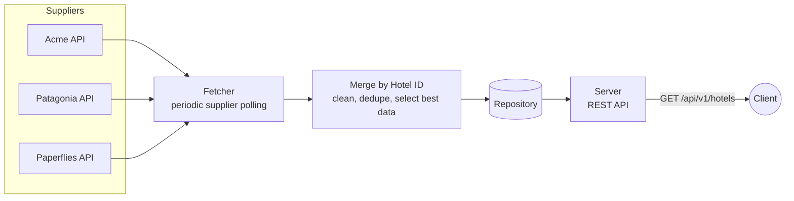

# Hotels Data Merge

This project contains HTTP Server that serves hotel data obtained form multiple suppliers (acme, paperflies, patagonia).
You can find the endpoint design in [openapi.yaml](openapi.yaml), or access the rendered version server at [localhost:8080/docs](localhost:8080/docs) once the server is running.

For full requirements specification, see [REQUIREMENTS.md](REQUIREMENTS.md)

## Data Flow

## Usage

1. Start the server ([see section on Running The HTTP Server](#running-the-http-server))
1. open the swaggerdoc included

## Running The HTTP Server

This projects includes multiple ways to start the server.

### Docker

Assumes a running version of [Docker](https://www.docker.com/products/docker-desktop/) on your machine

1. `docker build -t hotels_datamerge .`
1. run
    - in background: `docker run -d --name hotels_datamerge -p 8080:8080 hotels_datamerge`
    - in foreground: `docker run --rm --name hotels_datamerge -p 8080:8080 hotels_datamerge`
1. show logs `docker logs -f hotels_datamerge`
1. stop image `docker stop hotels_datamerge`

### Binary

1. navigate to [the project's Releases page](https://github.com/JoelLau/hotels_datamerge/releases)
1. under the latest release, expand the Assets dropdown
1. download the binary file relevant to your machine:
    - macos (arm / m+ chips)
        - download hotels_data_merge-darwin-arm64
        - give it permissions to execute `chmod a+x hotels_data_merge-darwin-arm64`
        - run the binary `./hotels_data_merge-darwin-arm64`
    - windows
        - download hotels_data_merge-windows-amd64.exe
        - double click to run

additional notes:

- use ctrl+c (SIGINT) to terminate the service

### Native Go

requires [Go (the program)](https://go.dev/)

1. install dependencies `go mod tidy`
1. run `go run cmd/main.go`
1. ctrl + c (SIGINT) to terminate the service

## Development / Commands

- install dependencies `go mod tidy`
- generate code
  - openapi codege `go generate ./gen/api/...`
  - `openapi.yaml` is the source of truth for the API; after editing it, rerun codegen before building so generated types/server interfaces in `gen/api/` don't drift from the spec
- build the binary `go build ./...`
- run tests: `go test ./...`
- format code: `golangci-lint fmt` (runs `gofumpt` + `goimports`, configured in `.golangci.yml`)
- lint: `golangci-lint run` (enables `errorlint`, `revive`, `misspell`, `unconvert`, `unparam`, `paralleltest`, `tparallel`)
- vet: `go vet ./...`
- run locally: `go run cmd/main.go`

## Field Selection Rules

**Rule of Thumb**: assume longest string is most details / precise

| Field                | Rule                                                       |
| -------------------- | ---------------------------------------------------------- |
| `id`                 | take first value (assume unique after merge)               |
| `destination_id`     | take first value (assume unique after merge)               |
| `name`               | take longest                                               |
| `description`        | take longest                                               |
| `location.address`   | take longest                                               |
| `location.city`      | take longest                                               |
| `location.country`   | take longest                                               |
| `location.lat`       | take first complete data (source must have both lat + lng) |
| `location.lng`       | take first complete data (source must have both lat + lng) |
| `amenities.general`  | take all, remove duplicates                                |
| `amenities.room`     | take all, remove duplicates                                |
| `images.rooms`       | take all, remove duplicates                                |
| `images.site`        | take all, remove duplicates                                |
| `images.amenities`   | take all, remove duplicates                                |
| `booking_conditions` | take all, remove duplicates                                |

## Deviations from REQUIREMENTS.md

- `GET /api/v1/hotels` endpoint
  - returns 200 OK if no query params are applied
    - follows REST conventions to return all
  - any number of query parameters can be applied (none, 1, both)
- `GET /livez`, `GET /readyz` endpoints
  - quick win to be k8s ready
  - `readyz` is used in Dockerfile healthcheck
