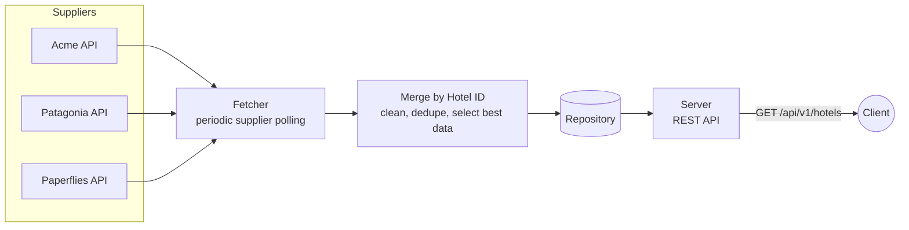

# Hotels Data Merge

To see what this project is about, see [REQUIREMENTS.md](REQUIREMENTS.md)

## Usage

_**TODO**: list instructions and pre-requisites to running this project_

## OpenAPI Codegen

Server types and the chi `ServerInterface` are generated from [openapi.yaml](openapi.yaml) into `gen/api/`.

To regenerate after editing `openapi.yaml`:

```sh
go generate ./gen/api/...
```

## Design



## Field Selection Rules

**Rule of Thumb**: assume longest string is most details

| Field                | Rule                                                       |
| -------------------- | ---------------------------------------------------------- |
| `id`                 | take first value (assume unique after merge)               |
| `destination_id`     | take first value (assume unique after merge)               |
| `name`               | take longest                                               |
| `description`        | take longest                                               |
| `location.address`   | take longest                                               |
| `location.city`      | take longest                                               |
| `location.country`   | take longest                                               |
| `location.lat`       | take first complete data (source must have both lat + lng) |
| `location.lng`       | take first complete data (source must have both lat + lng) |
| `amenities.general`  | take all, remove duplicates                                |
| `amenities.room`     | take all, remove duplicates                                |
| `images.rooms`       | take all, remove duplicates                                |
| `images.site`        | take all, remove duplicates                                |
| `images.amenities`   | take all, remove duplicates                                |
| `booking_conditions` | take all, remove duplicates                                |

## Deviations from REQUIREMENTS.md

- `GET /api/v1/hotels` endpoint
  - returns 200 OK if no query params are applied
    - follows REST conventions to return all
  - any number of query parameters can be applied (none, 1, both)
- `GET /livez`, `GET /readyz` endpoints
  - quick win to be k8s ready
  - `readyz` is used in Dockerfile healthcheck
